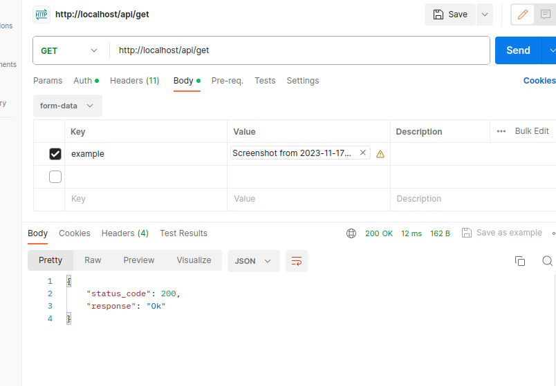

# Lua-framework


## Dependencies
 - luarocks install luasql-sqlite3
 - luarocks install luasql-postgres
 - luarocks install luasql-mysql
 - luarocks install luasql-sqlite
 - luarocks install luasql-cjson
 - ubus
 - uci


## Description


I created a framework during my internship that integrates essential OpenWRT services, specifically UCI (Unified Configuration Interface), UBUS (micro bus), and UHTTPD (micro HTTP server). This framework is designed to facilitate HTTP requests, making it a valuable tool for a variety of network-related tasks.


# Usage


## General usage
 - in http directory file config.lua change 'settings' section 'orm' to sql or uci
 - in http directory file config.lua change 'assets_dir' section to you wanted directory if it isn't present it will be created
 - In http directory create file where you will store Models

### Required imports 

local Table = require("orm.model")
local fields = require("orm.field_type")

 - Create directory controllers where you will store you controller files
 - Controller example
```lua
function Sample.index(request, response)
    --Do stuff
    return response:response()
end
```

 ### Every controller must have response
 
 - response:with_message(message):response()
 - response:with_json(json):response()
 - return response:with_status(400):response()
 - return response:with_status(200):with_message(res):response()

### request contains

 - local data = request.data   Json data
 - local data = request.headers   Headers data
 - local data = request:query_table()   Query  data


### Initialize router object
```lua
local router = require("framew.router")
local rr = router:new()

rr:post("/api/create", "posts.createUser")
rr:post("/api/delete/{id}", "posts.deleteUser") --required id, route could look like this -> localhost/api/delete/1
rr:post("/api/delete/{id?}", "posts.deleteUser") --optional id, route could look like this -> localhost/api/delete/1 or localhost/api/delete
 -- or 
rr:post("/api/create", "posts.createUser", {"auth"}) -- only authentificated users can access this endpoint

return rr
```
### In endpoint.lua require routes instance and initialize 
```lua
local endpoint = {}

local rr = require("http.routes.routes")

function endpoint:handle_request()
    rr:route()

end
return endpoint
```
### You are able to upload images



## Usage for Sql
 - in http directory file config.lua change 'DB' settings

 ```
 settings.DB = {
    DEBUG = true,
    new = true,
    backtrace = true,
    name = "database.db",
    type = "sqlite3",
}
 ```

 ### Create model
```lua
models.User = Table({
    __tablename__ = "user",
    username = fields.CharField({max_length = 100, unique = true}),
    password = fields.CharField({max_length = 50, unique = true}),
    age = fields.IntegerField({max_length = 2, null = true}),
    job = fields.CharField({max_length = 50, null = true}),
    time_create = fields.DateTimeField({null = true})
})
```
 ### In Your controller file require model
```lua
local models = require("http.models.posts_models")
local User = models.User
```

 - Example
```lua
function Sample.createUser(request, response)
    local data = request.data
   
    local user = User({
        username = data.username,
        password = data.password,
        time_create = os.time()
    })
    user:save()

   
    return response:with_message("Ok"):response()
end
```
### Other User methods

 - Get
```lua
local users = User.get:all()
users = User.get:limit(2):all()
users = User.get:limit(2):offset(2):all()
users = User.get:order_by({desc('age')}):all()
users = User.get:group_by({'age'}):all()
user = User.get:where({username = "First user"}):first()
users = User.get:group_by({'id'}):having({age = 44}):all()
```

 - Update
```lua
user.username = "John Smith"
user:save()
```
 - Delete
```lua
User.get:where({username = "SomebodyNew"}):delete()
```
### More Info About Sql ORM
 - https://github.com/itdxer/4DaysORM

## Usage for uci 

### model example
```lua
models.User = Config({
    __configname__ = "user",
    username = fields.Option(),
    password = fields.Option(),
    age = fields.Option(),
    job = fields.Option(),
})
```
### User methods

 - Create
```lua
local user1 = User({
        username = data.username,
        password = data.password,
        age = data.age,
        job = data.job,
 
    })
user1:save()
user1:with_name(name)  --Named section
```
 - Get
```lua
local user = User.get:where({username = "Antanas"}):first()
local user = User.get:all_obj() -- returns all users as objects
local user = User.get:all() -- returns all users info in tables it can be converted to json

```
 - Update
```lua
local user = User.get:where({username = "name"}):first()
user.username = "name1"
user:save()
```

 - Delete
```lua
 user:delete()
```
 - Validate
 Available validations: 
```lua
" required|length:x|email|letters|numbers "
```
```lua
local condition, msg = user1:validate('age', "required|length:5")
    if condition then
        user1:save()
        return response:with_status(201):with_message("User created"):response()     
    else
        return response:with_status(400):with_message(msg):response()
    end
```
